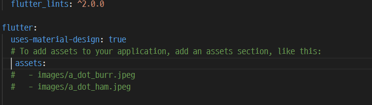
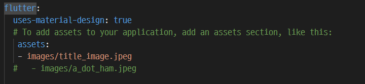

# Flutter 에서 고정된(static) image 사용하기

- 프로젝트 폴더에 이미지를 저장할 폴더 만들기
- 생성한 폴더에 사용할 이미지를 복사 하여 저장하기
- 이미지 이름은 snack case 로 사용해야한다 (소문자에 `_` 사용 )

## 프로젝트에 이미지 등록하기

-`pubspec.yaml`파일에 이미지 등록하기

- 라인의 첫 칼럼에서 `flutter` 시작되는 설정 찾기
- `assets:` 설정 찾아서 주석제거하기 
- `assets:` 설정 아래에 이미지 등록하기 
