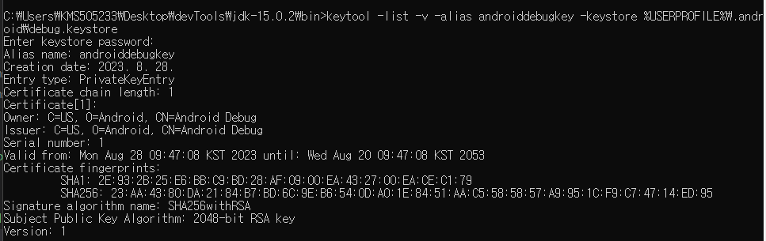

# firebase plug in

- https://firebase.google.com/docs/flutter/setup?hl=ko&authuser=0&_gl=1*1w1fkhx*_ga*NzIyOTYxMDU1LjE2OTI5MjQ0MzM.*_ga_CW55HF8NVT*MTY5NDM5MTY0OC4xMi4xLjE2OTQzOTIwOTMuMC4wLjA.&platform=ios#available-plugins

- firebase_core, firebase_auth, cloud_firebase 설치 필요
- flutter pub add firebase_core firebase_auth cloud_firestore

## 의존성 여부 확인

```bash
flutter pub upgrade outdataed package
flutter clean
flutter pub get

```

## firebase 와 Google 로그인 설정하기 (2023-09-11)

- firebase 콘솔에서 Authentication 에서 google 공급업체 추가하기

## SHA 인증서 확인하기

- `JDK(jre) / bin` 폴더에서 keytool.exe 파일 찾기
- keytool을 사용하여 SHA 인증서 확인하기
- bin 폴더에서 CMD 관리자 권한으로 창 열기

```cmd
keytool -list -v -alias androiddebugkey -keystore %USERPROFILE%\.android\debug.keystore
password : andriod

```
